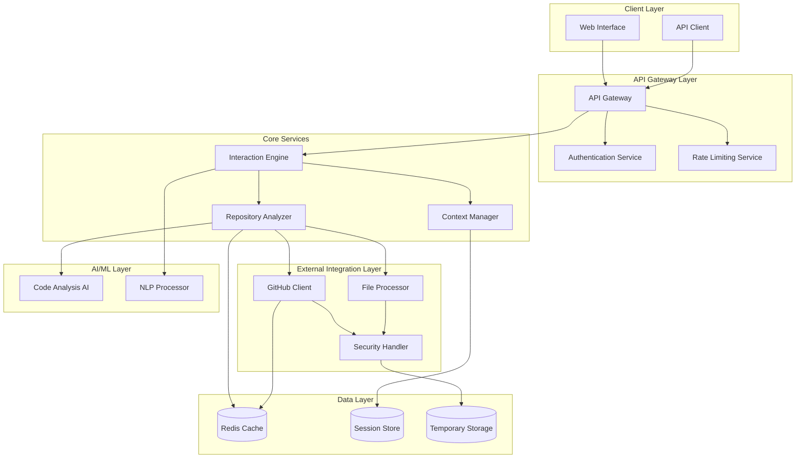

# Design Document: DevSensei

## Overview

DevSensei is designed as a modular, cloud-based AI assistant that provides intelligent code analysis and explanations through multiple interaction modes. The system follows a microservices architecture with clear separation between repository access, analysis, and user interaction components.

The core design philosophy emphasizes:
- **Security-first**: All repository access and token handling follows security best practices
- **Modularity**: Each component has a single responsibility and can be developed/deployed independently  
- **Scalability**: Stateless design with caching and rate limiting for high concurrent usage
- **Explainability**: AI outputs are structured to provide clear, contextual explanations rather than generic responses

## Architecture

The system follows a layered microservices architecture:



## AI Model and Prompting Strategy

DevSensei uses a structured prompt orchestration strategy to ensure consistent, explainable, and mode-aware AI responses.

Key aspects include:

- Repository context is transformed into structured summaries before being sent to the AI layer.
- Interaction modes act as prompt modifiers that control explanation depth, tone, and output format.
- Prompts are designed to prioritize reasoning, architectural intent, and learning outcomes over code generation.

Example Prompt Inputs:
- Repository structure summary
- Selected interaction mode
- User query
- Relevant code excerpts

This approach ensures deterministic behavior across modes while maintaining flexibility for diverse repositories.

## Components and Interfaces

### API Gateway
**Responsibility**: Request routing, authentication, and rate limiting
**Key Interfaces**:
- `POST /analyze/github` - Analyze GitHub repository
- `POST /analyze/upload` - Analyze uploaded files  
- `POST /query` - Natural language queries
- `GET /session/{id}` - Retrieve session context
- `DELETE /session/{id}` - Clear session

### Interaction Engine
**Responsibility**: Orchestrates user interactions and mode-specific responses
**Key Methods**:
```typescript
interface InteractionEngine {
  processQuery(query: string, mode: InteractionMode, sessionId: string): Promise<Response>
  switchMode(mode: InteractionMode, sessionId: string): Promise<void>
  generateExplanation(codeContext: CodeContext, mode: InteractionMode): Promise<string>
}

enum InteractionMode {
  EXPLORE = "explore",
  EXPLAIN = "explain", 
  DEBUG = "debug",
  LEARN = "learn",
  SUMMARIZE = "summarize"
}
```

### Repository Analyzer
**Responsibility**: Analyzes repository structure and generates code insights
**Key Methods**:
```typescript
interface RepositoryAnalyzer {
  analyzeRepository(repoUrl: string, accessToken?: string): Promise<RepositoryAnalysis>
  analyzeFiles(files: UploadedFile[]): Promise<FileAnalysis>
  extractArchitecture(fileStructure: FileTree): Promise<ArchitectureInsight>
  identifyPatterns(codebase: ParsedCodebase): Promise<DesignPattern[]>
}

interface RepositoryAnalysis {
  structure: FileTree
  architecture: ArchitectureInsight
  dependencies: Dependency[]
  entryPoints: EntryPoint[]
  patterns: DesignPattern[]
}
```

### GitHub Client
**Responsibility**: Secure GitHub API integration with rate limiting
**Key Methods**:
```typescript
interface GitHubClient {
  fetchRepository(url: string, token?: string): Promise<Repository>
  getFileContents(repo: Repository, path: string): Promise<string>
  getRepositoryTree(repo: Repository): Promise<FileTree>
  checkRateLimit(): Promise<RateLimitStatus>
}
```

### Context Manager
**Responsibility**: Maintains conversation context and session state
**Key Methods**:
```typescript
interface ContextManager {
  createSession(repositoryId: string): Promise<string>
  updateContext(sessionId: string, interaction: Interaction): Promise<void>
  getContext(sessionId: string): Promise<ConversationContext>
  summarizeContext(sessionId: string): Promise<ContextSummary>
}

interface ConversationContext {
  sessionId: string
  repositoryId: string
  interactions: Interaction[]
  currentMode: InteractionMode
  focusAreas: string[]
}
```

### Security Handler
**Responsibility**: Secure token management and access control
**Key Methods**:
```typescript
interface SecurityHandler {
  encryptToken(token: string): Promise<string>
  decryptToken(encryptedToken: string): Promise<string>
  validateRepositoryAccess(repoUrl: string, token?: string): Promise<boolean>
  sanitizeUploadedFile(file: UploadedFile): Promise<SanitizedFile>
  cleanupTempData(sessionId: string): Promise<void>
}
```

## Data Models

### Core Domain Models

```typescript
interface Repository {
  id: string
  url: string
  name: string
  owner: string
  isPrivate: boolean
  defaultBranch: string
  language: string
  size: number
}

interface FileTree {
  root: FileNode
  totalFiles: number
  languages: LanguageStats[]
}

interface FileNode {
  name: string
  path: string
  type: 'file' | 'directory'
  size?: number
  language?: string
  children?: FileNode[]
}

interface ArchitectureInsight {
  pattern: string // e.g., "MVC", "Microservices", "Layered"
  description: string
  keyComponents: Component[]
  dataFlow: DataFlowDescription
}

interface Component {
  name: string
  type: string // e.g., "controller", "service", "model"
  files: string[]
  responsibilities: string[]
  dependencies: string[]
}

interface Interaction {
  id: string
  timestamp: Date
  query: string
  mode: InteractionMode
  response: string
  codeReferences: CodeReference[]
}

interface CodeReference {
  file: string
  startLine?: number
  endLine?: number
  function?: string
  class?: string
}
```

### Response Models

```typescript
interface ExploreResponse {
  overview: string
  architecture: ArchitectureInsight
  keyFiles: string[]
  suggestedNextSteps: string[]
}

interface ExplainResponse {
  explanation: string
  codeSnippets: CodeSnippet[]
  relatedConcepts: string[]
  furtherReading: string[]
}

interface DebugResponse {
  issueAnalysis: string
  rootCause: string
  suggestedFixes: Fix[]
  preventionTips: string[]
}

interface LearnResponse {
  conceptExplanation: string
  examples: CodeExample[]
  practiceExercises: string[]
  resources: LearningResource[]
}

interface SummarizeResponse {
  summary: string
  keyFeatures: string[]
  technicalStack: string[]
  documentation: GeneratedDoc[]
}
```

## Explainability and User Trust

DevSensei prioritizes explainable AI outputs by:

- Referencing specific files, functions, and line ranges in explanations
- Breaking down reasoning steps during debugging and learning modes
- Clearly stating assumptions and uncertainty when interpretations are ambiguous

The system avoids hallucinated explanations by grounding responses strictly in repository content and user-provided context.

## Error Handling

The system implements comprehensive error handling across all layers:

### Error Categories
1. **Client Errors (4xx)**:
   - Invalid repository URLs
   - Authentication failures
   - Rate limit exceeded
   - Malformed requests

2. **Server Errors (5xx)**:
   - GitHub API failures
   - AI service unavailability
   - Database connection issues
   - Internal processing errors

3. **Business Logic Errors**:
   - Repository access denied
   - Unsupported file types
   - Analysis timeout
   - Context limit exceeded

### Error Response Format
```typescript
interface ErrorResponse {
  error: {
    code: string
    message: string
    details?: any
    suggestions?: string[]
    retryable: boolean
  }
  requestId: string
  timestamp: string
}
```

### Recovery Strategies
- **Exponential backoff** for GitHub API rate limits
- **Graceful degradation** when AI services are unavailable
- **Partial results** when complete analysis fails
- **Context summarization** when memory limits are reached

## Success Metrics

DevSensei effectiveness can be evaluated using:

- Time-to-understanding for new repositories
- Accuracy of architectural explanations
- User satisfaction across interaction modes
- Reduction in onboarding or debugging time

## Deployment and Hackathon Scope

For the hackathon implementation, DevSensei will be deployed as:

- A web-based application
- Cloud-hosted backend services
- Managed AI services via Amazon Bedrock or Amazon Q

The initial scope focuses on:

- Read-only repository analysis
- Limited language support
- Stateless session handling

This scoped approach ensures a functional, demonstrable prototype while allowing future expansion.

## Testing Strategy

The testing approach combines unit testing for individual components with property-based testing for core system behaviors, ensuring both specific functionality and universal correctness properties.

### Unit Testing Focus
- Component interface compliance
- Error handling scenarios
- Security validation
- API response formatting
- Cache behavior

### Property-Based Testing Focus
- Universal system behaviors across all inputs
- Data consistency and integrity
- Security properties
- Performance characteristics

### Integration Testing
- End-to-end user workflows
- GitHub API integration
- Multi-service communication
- Session management

### Testing Configuration
- Property tests: minimum 100 iterations per test
- Test tagging: **Feature: devsensei, Property {number}: {property_text}**
- Continuous integration with automated test execution
- Performance benchmarking for response times

## Correctness Properties

*A property is a characteristic or behavior that should hold true across all valid executions of a system—essentially, a formal statement about what the system should do. Properties serve as the bridge between human-readable specifications and machine-verifiable correctness guarantees.*

### Property 1: Repository Analysis Consistency
*For any* valid GitHub repository URL, the GitHub_Client should successfully fetch repository metadata and file structure, and the Repository_Analyzer should identify folder structures, file types, dependencies, and architectural patterns consistently across all analysis attempts.
**Validates: Requirements 1.1, 3.1, 3.3, 3.4**

### Property 2: Security Token Handling
*For any* GitHub access token provided by users, the Security_Handler should encrypt and securely store the token, use it appropriately for repository access while respecting permissions, and properly clean up the token data when sessions end.
**Validates: Requirements 1.2, 7.1, 7.2, 7.5**

### Property 3: Rate Limiting and Backoff
*For any* sequence of GitHub API calls that approach rate limits, the Rate_Limiter should implement exponential backoff and graceful degradation, ensuring the system continues to function without violating API constraints.
**Validates: Requirements 1.3**

### Property 4: Code Execution Prevention
*For any* code content processed by the system (whether from GitHub repositories or uploaded files), the Security_Handler should ensure no code execution occurs on the server, maintaining strict read-only analysis.
**Validates: Requirements 1.5, 7.3**

### Property 5: File Processing Consistency
*For any* uploaded programming file in supported formats, the File_Processor should accept the file, sanitize potentially malicious content, and analyze it using the same pipeline as GitHub repositories, producing equivalent results for identical code.
**Validates: Requirements 2.1, 2.3, 2.4**

### Property 6: Interaction Mode Behavior
*For any* user query and selected interaction mode (Explore, Explain, Debug, Learn, Summarize), the Interaction_Engine should provide responses that match the expected characteristics and depth level of that mode consistently across all repositories and queries.
**Validates: Requirements 4.1, 4.2, 4.3, 4.4, 4.5**

### Property 7: Natural Language Query Processing
*For any* natural language question about a codebase, the System should interpret the query, provide relevant code-based answers with appropriate references, handle ambiguity through clarification or multiple interpretations, and maintain conversation context for follow-up questions.
**Validates: Requirements 5.1, 5.2, 5.3, 5.4**

### Property 8: Context Management Integrity
*For any* conversation session, the Context_Manager should maintain relevant conversation history, provide consistent responses when referencing previous explanations, intelligently summarize when context limits are reached, and properly isolate context between different repositories.
**Validates: Requirements 6.1, 6.2, 6.3, 6.4**

### Property 9: Secure Communication and Data Protection
*For any* data transmission or processing operation, the System should implement secure communication protocols, protect user privacy in error logging, and ensure all security measures are consistently applied regardless of data type or source.
**Validates: Requirements 7.4, 9.4**

### Property 10: Performance Consistency
*For any* typical repository analysis request, the System should respond within 5 seconds, maintain performance under concurrent access, implement appropriate caching to avoid redundant operations, and handle resource constraints gracefully with proper user feedback.
**Validates: Requirements 8.1, 8.2, 8.4, 8.5**

### Property 11: Progressive Loading for Large Repositories
*For any* large repository analysis request, the System should provide progressive loading and partial results rather than blocking until complete analysis is finished.
**Validates: Requirements 8.3**

### Property 12: Comprehensive Error Handling
*For any* error condition (GitHub API errors, analysis failures, invalid inputs, partial failures), the System should provide user-friendly error messages with suggested solutions, explain failure reasons with alternative approaches, validate inputs with clear correction guidance, and provide partial results with appropriate warnings when possible.
**Validates: Requirements 9.1, 9.2, 9.3, 9.5**

### Property 13: Documentation Generation Consistency
*For any* repository or module documentation generation request, the System should produce markdown-formatted output that includes key architectural decisions and components, augments rather than replaces existing documentation, follows clear structural patterns suitable for README/wiki use, and focuses on public interfaces for module-specific documentation.
**Validates: Requirements 10.1, 10.2, 10.3, 10.4, 10.5**